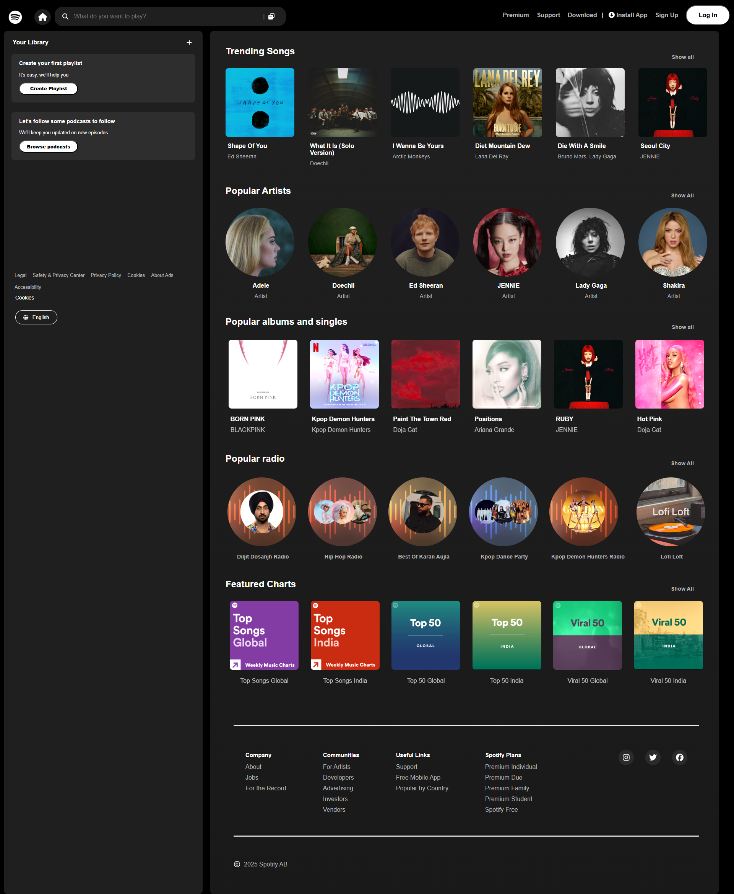

# 🎧 Spotify UI Clone

A responsive and aesthetic clone of the Spotify Desktop UI — built using **React**.  
Bringing music vibes to the browser, one div at a time 🎶

⚡ **Live Demo:** [Click here to see it live](https://erleen0307.github.io/spotify-ui-clone/)

---

## 📸 Preview



---

## ✨ Features

- 🎵 Home and Library sections styled like Spotify
- 🔒 Fixed sidebar and sticky header layout
- ⚡ Smooth hover effects and transitions
- 🚀 Fast static deployment on GitHub Pages

---

## 🛠️ Tech Stack

- **Framework:** React
- **Styling:**  CSS
- **Icons:** Font Awesome
- **Build Tool:** Vite
- **Deployment:** GitHub Pages

---

## 🧑‍💻 Getting Started

### Clone the repository

```bash
git clone https://github.com/erleen0307/spotify-ui-clone.git
cd spotify-ui-clone
````

### Install dependencies

```bash
npm install
```

### Start the development server

```bash
npm run dev
```

### Build for production

```bash
npm run build
```

### Deploy to GitHub Pages

```bash
npm run deploy
```

---

## 📁 Folder Structure

```
📦 spotify-ui-clone
 ┣ 📂public
 ┣ 📂src
 ┃ ┣ 📂assets
 ┃ ┣ 📂components
 ┃ ┣ 📜App.jsx
 ┃ ┣ 📜main.jsx
 ┣ 📜index.html
 ┣ 📜tailwind.config.js
 ┣ 📜vite.config.js
 ┣ 📜package.json
```

---

## 🚧 Project Status

* ✅ All done!
* ❌ No backend or login/authentication (UI only)

---

## 📣 A Note from Me

I'm a self-taught developer and this was one of my favorite builds so far.
I learned a lot through this project, and I’m excited to keep improving!

If you enjoyed this, consider giving it a ⭐ or sharing it with others.
Feedback and DMs are always welcome 😄

---

## 📌 Author

**Erleen**
[GitHub Profile](https://github.com/erleen0307)
[Instagram Profile](https://www.instagram.com/codeandcanvas.dev/)

Made with ❤️ and React

